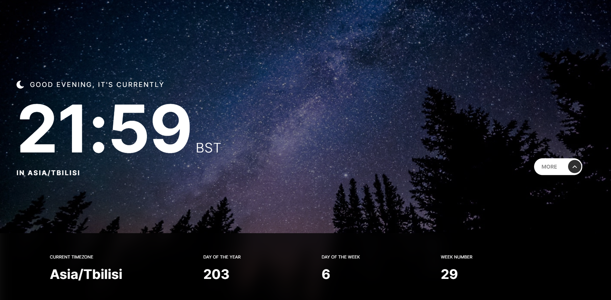
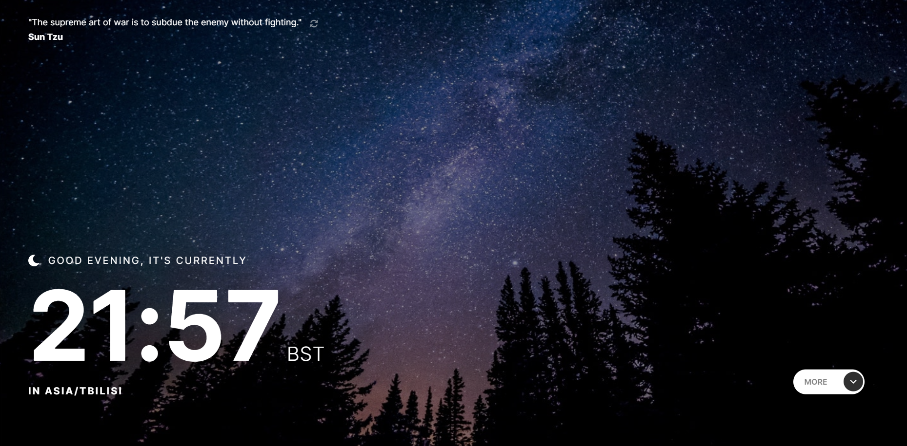
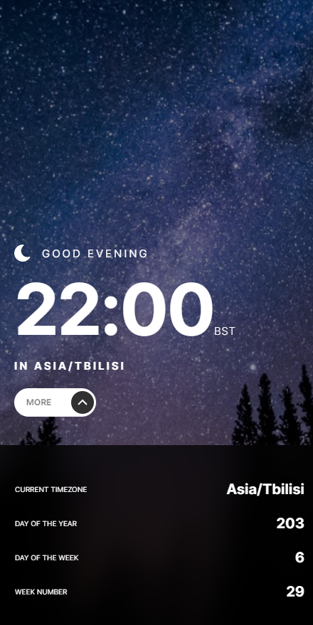
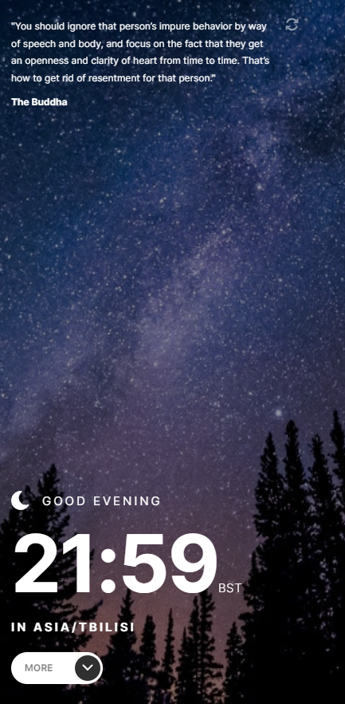
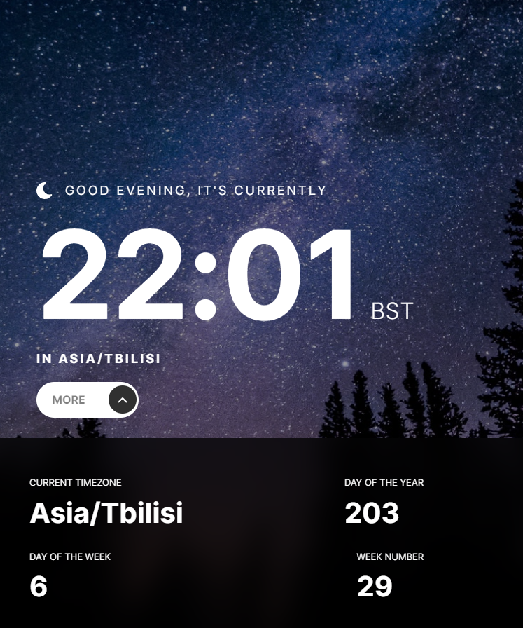
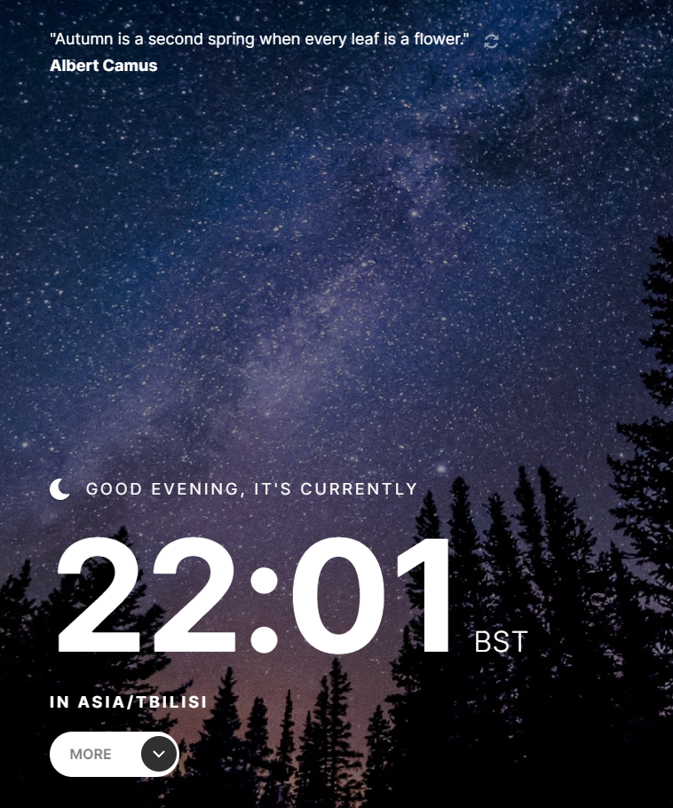

# Clock-App

## [Design(Figma)](https://www.figma.com/file/DN9n5Yoz8Z3XivGpjDUgxu/clock-app?node-id=0%3A284&mode=dev)

## [Live URL](https://clock-app-pied-six.vercel.app)

## Technologies Used

- Vite
- React
- TypeScript
- Styled Components

## APIs Used

- [Random Quotes](https://api.quotable.io/random)
- [World Time API](https://worldtimeapi.org/api/ip)

## Getting Started

To get a local copy of the project up and running, follow these steps:

1.  Clone the repository:

    ```shell
    git clone https://github.com/TemuriTsutskiridze/Clock-App.git
    ```

2.  Install the dependencies:

    ```shell
    cd project-name
    npm install
    ```

## Design Preview







